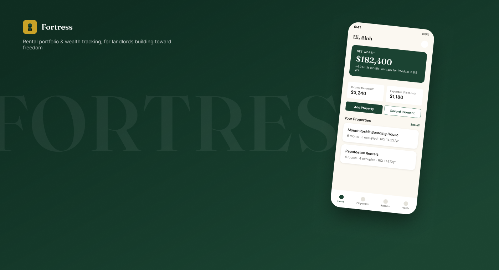
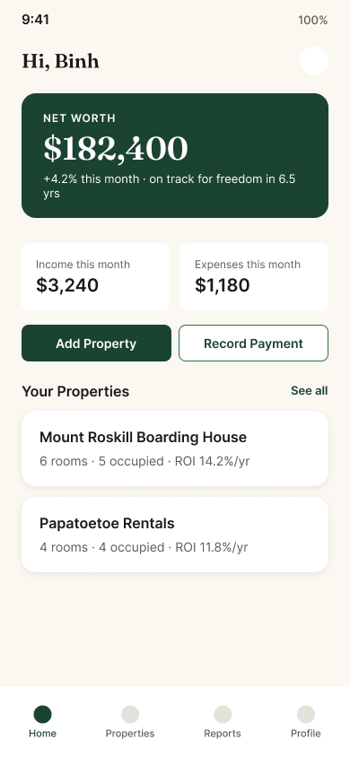
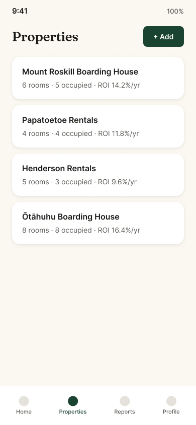
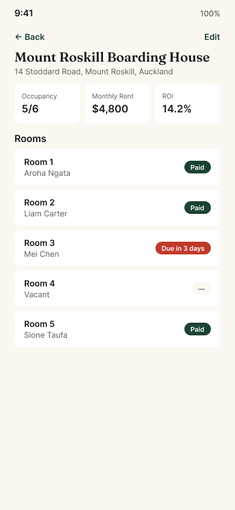
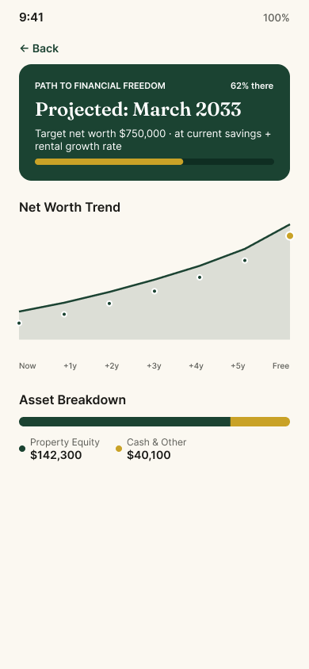
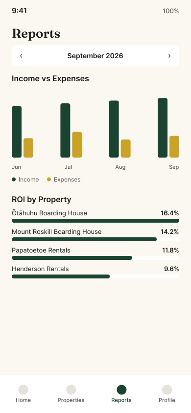
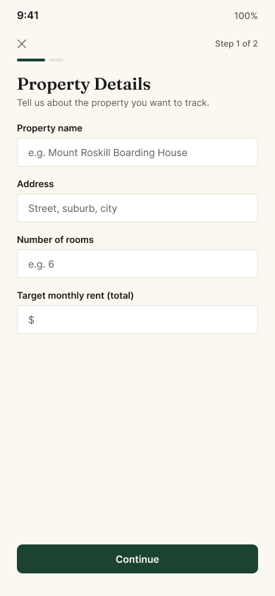

# Fortress — Wealth & Rental Portfolio App

A UX case study: designing a rental-property and net-worth tracking app for New Zealand landlords, built entirely in Figma with an AI-augmented workflow — Claude driving the Figma Plugin API directly through the Figma MCP connector.

**Full case study:** https://claude.ai/code/artifact/6331ac29-eaf8-49db-9245-8a15ce2e13ec
**Clickable Figma prototype:** https://www.figma.com/proto/F0gjx0sVWf9PLu9YbHQ5bh/Fortress-%E2%80%94-Wealth--amp--Rental-Portfolio-App?node-id=10-3&p=f&t=HHhOaKQb81p0Ic36-1&scaling=min-zoom&content-scaling=fixed&page-id=21%3A2&starting-point-node-id=10%3A3

## What this proves

1. **UI/UX design craft** — research (persona, empathy map), a shallow 13-screen information architecture, a from-scratch design system (color/type/spacing tokens, components), and 7 polished mobile screens.
2. **Figma mastery** — variables, component variants, auto-layout, prototyping reactions, all built through the real Figma Plugin API.
3. **AI-augmented workflow** — every frame, token, component, and prototype link in the Figma file was created by Claude executing Plugin API code, not a human dragging rectangles. 9+ real API gotchas were discovered and documented along the way.

## Repo contents

- [`PROJECT.md`](PROJECT.md) — project brief and narrative
- [`REQUIREMENTS.md`](REQUIREMENTS.md) — standing requirements/preferences captured along the way
- [`CURRENT-FEATURES.md`](CURRENT-FEATURES.md) — feature tracker + full build history
- [`design-log.md`](design-log.md) — design decisions (brand direction, IA, process)
- [`figma-mcp-capabilities.md`](figma-mcp-capabilities.md) — a real capability audit of the Figma MCP connector: what works, what doesn't, and every Plugin API gotcha hit while building this
- [`specs/`](specs/) — one spec per feature, worked one at a time
- [`behance-assets/`](behance-assets/) — exported screens and case-study images

## The screens

| | | |
|---|---|---|
|  |  |  |
|  |  |  |

---

Designed by [Binh Vo](https://github.com/binhvo9). Built with Figma Pro + Claude (Figma MCP).
